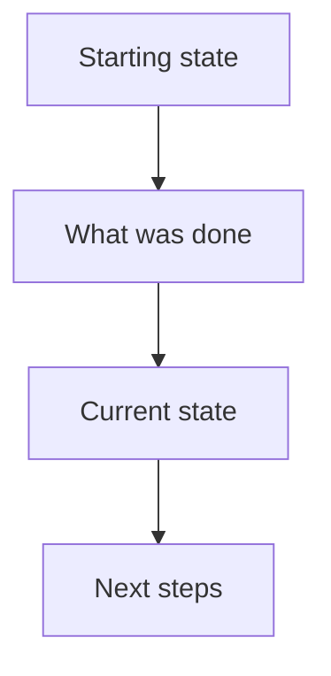

# Documentation Skill

Config-driven documentation scaffolding. Config lives inside the skill at `config/defaults.yaml` — no repo-root files needed.

## Commands

| Command | What to run |
|---------|-------------|
| start \<name\> | `bash ${AGENTS_SKILLS_DIR}/scripts/start.sh "<name>"` |
| expt \<name\> | `bash ${AGENTS_SKILLS_DIR}/scripts/expt.sh "<name>"` |
| plan \<index\> \<title\> | `bash ${AGENTS_SKILLS_DIR}/scripts/plan.sh <index> "<title>"` |
| finding \<index\> \<title\> | `bash ${AGENTS_SKILLS_DIR}/scripts/finding.sh <index> "<title>"` |
| ckpt \<index\> \<description\> | `bash ${AGENTS_SKILLS_DIR}/scripts/ckpt.sh <index> "<description>"` |
| research \<index\> \<topic\> | `bash ${AGENTS_SKILLS_DIR}/scripts/research.sh <index> "<topic>"` |
| review \<index\> \<title\> | `bash ${AGENTS_SKILLS_DIR}/scripts/review.sh <index> "<title>"` |
| learn \<index\> \<domain\> \<title\> | `bash ${AGENTS_SKILLS_DIR}/scripts/learn.sh <index> "<domain>" "<title>"` |
| list | `bash ${AGENTS_SKILLS_DIR}/scripts/list.sh` |
| status \<index\> | `bash ${AGENTS_SKILLS_DIR}/scripts/status.sh <index>` |
| resume \<index\> | `bash ${AGENTS_SKILLS_DIR}/scripts/resume.sh <index>` |

**`start` = scaffold docs/ + create experiment.** Use this when beginning new work.
**`expt` = create experiment only.** Use when docs/ already exists.

## Agent Behavior — READ THIS

**You are responsible for tracking the active experiment per conversation.** When the user creates an experiment or references one, remember its index. Pass it to every script call — scripts are stateless and parallel-safe.

### When to use each command

| User says... | You do... |
|---|---|
| "Let's investigate X" / starts new work | `/doc start "<name>"` — remember the returned index |
| "Plan this" / "How should we approach" | `/doc plan <idx> "<title>"` then write plan content into the created file |
| User enters plan mode | **STOP.** Do NOT use `.claude/plan.md`. Instead run `/doc plan <idx> "<title>"` and write directly there. Plans live in experiment folders, never in ephemeral storage. |
| You discover something significant | `/doc finding <idx> "<title>"` then write finding content |
| Conversation wrapping up / context switch | `/doc ckpt <idx> "<short-label>"` — short label only (2-5 words), then **write body content into the file** with What/Why/How + mermaid diagram. **Do this automatically without being asked.** |
| "Research X" / "Look into Y" | `/doc research <idx> "<topic>"` — write prompt, do research, write results |
| "Review X" / "Check this output" | `/doc review <idx> "<title>"` then write review content with verdict |
| "Remember this" / "Key learning" | `/doc learn <idx> <domain> "<title>"` — write distilled insight |
| "Continue experiment 19" / "Pick up" | `/doc resume <idx>` — reads meta + latest plan + latest checkpoint. Set as active for this conversation. |
| "What experiments exist?" | `/doc list` |
| "What's the state of experiment 19?" | `/doc status <idx>` |

### Context resolution (when user doesn't give an index)

1. Experiment created or resumed in this conversation → use it
2. User referenced one by name/number → use it
3. User's request clearly relates to one experiment → use it
4. Ambiguous → ask: "Which experiment?" then run `/doc list` to show options

**You resolve context. Scripts just take a number.**

### Auto-behaviors

- **Checkpoint automatically** at natural stopping points — end of conversation, before context switch, after a milestone. Don't wait to be asked.
- **Plans go in experiments.** NEVER write plans to `.claude/plan.md` or any ephemeral storage. ALWAYS use `/doc plan`.
- **Never overwrite.** Always create new numbered files. Plans evolve: 01, 02, 03.
- **Resume before continuing.** When picking up an existing experiment, run `/doc resume` first to load context.

### Checkpoint content — MANDATORY

The `ckpt` command arg is a **short label** (2-5 words), NOT the checkpoint content. After the script creates the file, you MUST write the body into it using this structure:

````markdown


## What
What was accomplished. Bullet points, brief.

## Key Takeaways
Surprising findings, confirmed/rejected hypotheses, numbers that matter.

## Issues
Blockers hit, workarounds used, unresolved problems. Include error messages if relevant.

## Decisions
Key choices made and why. What was considered and rejected.

## Next
Concrete next steps with enough detail that a new agent can pick up cold.
Include file paths, command examples, and what to watch out for.
````

The checkpoint must contain **everything a fresh agent needs to continue the work without asking questions.** Be brief but complete — file paths, key numbers, what worked, what didn't.

**DO NOT** cram content into the description argument. Keep the arg short: `/doc ckpt 7 "v1 analysis complete"` then edit the file.

## Experiment Structure

```
experiments/NNN-{name}/
├── .meta.json          auto-updated by scripts
├── plans/              multiple plans, numbered
├── findings/           multiple findings, numbered  
├── checkpoints/        progress snapshots, numbered
├── review/             structured reviews, numbered
└── research/           prompt + response pairs, numbered
```

## Setup

`/doc start my-investigation` — that's it. Scaffolds docs/ and creates the first experiment.

To customize folder structure or naming: edit `config/defaults.yaml` inside the skill.

## Rules

1. **Scripts only create empty templates (frontmatter + headings). YOU must write the actual content into the file after the script runs.** Never treat the script call as the finished step.
2. **Always use the scripts** for file creation. Never manually create experiment dirs or edit `.meta.json`.
2. **Index is just the number.** `23` not `023` not `023-docs-and-structs`.
3. **No auto-commit.** Scripts scaffold files — you or the user decide when to commit.
4. **Plans go in experiments.** Never in `.claude/plan.md`. This is non-negotiable.
5. **Files are immutable.** Don't edit old plans/findings — create a new numbered one.
6. **Valid learnings domains** are listed in `config/defaults.yaml`. `learn` will error on invalid domains.
7. **Keep titles short.** Titles become filenames. Use 2-5 words max — concise and descriptive. `"auth-flow"` not `"investigation-into-authentication-flow-reliability-issues"`. The numbering prefix handles ordering; the title just needs to identify the topic at a glance.

$ARGUMENTS
