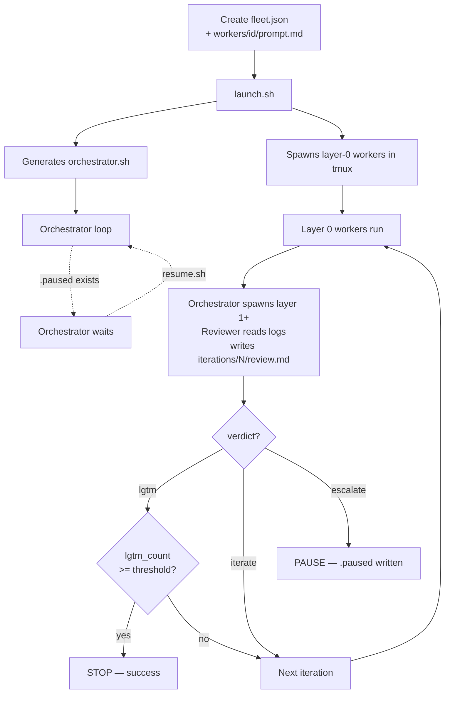

# iterative-fleet — Quick Reference

## Lifecycle



## Commands

| Script | Args | Description |
|--------|------|-------------|
| `launch.sh` | `<fleet-root> [--dry-run]` | Parse fleet.json, generate orchestrator.sh, spawn workers + orchestrator in tmux |
| `status.sh` | `<fleet-root>` | Show iteration count, verdict history, per-worker status, cost |
| `pause.sh` | `<fleet-root>` | Touch `.paused` — orchestrator stops at next iteration boundary |
| `resume.sh` | `<fleet-root>` | Remove `.paused` — orchestrator continues |
| `kill.sh` | `<fleet-root> all [--force]` | Hard stop: kill tmux session, sweep orphans, unregister |

Run all scripts as: `bash ${AGENTS_SKILLS_DIR}/scripts/<script> <fleet-root>`

## Verdict Interface

The reviewer writes `iterations/<N>/review.md` containing exactly one verdict line:

| Verdict | Meaning | Orchestrator action |
|---------|---------|---------------------|
| `verdict: lgtm` | Output approved | Increments lgtm count; stops if threshold met |
| `verdict: iterate` | Needs another round | Starts next iteration |
| `verdict: escalate` | Needs human attention | Writes `.paused`, halts loop |

**Only `verdict: lgtm` counts toward the stop condition.** "Looks mostly good" = `iterate`.

## Minimal fleet.json

```json
{
  "fleet_name": "my-fleet",
  "type": "iterative",
  "config": {
    "max_concurrent": 2,
    "model": "sonnet",
    "max_iterations": 10
  },
  "workers": [
    {
      "id": "builder",
      "type": "code-run",
      "task": "Do the work",
      "max_budget_per_iter": 1.0
    },
    {
      "id": "reviewer",
      "type": "reviewer",
      "depends_on": ["builder"],
      "task": "Read iterations/<N>/builder.log. Write verdict: lgtm | iterate | escalate"
    }
  ],
  "stop_when": {
    "reviewer_lgtm_count": 2,
    "max_iterations": 10,
    "cost_cap_usd": 5.0
  }
}
```

## DAG ordering (depends_on)

Each iteration executes workers as a DAG. Use `depends_on` to declare ordering:

```json
{ "id": "reviewer", "type": "reviewer", "depends_on": ["builder"] }
```

- Layer 0 (no deps) spawned at launch
- Layer 1+ spawned by orchestrator after prior layer completes
- Works with multi-layer DAGs (e.g., researcher → builder → reviewer)
- If no `depends_on` exists, all workers run in parallel (backward compatible)

## Common Gotchas

1. **No reviewer worker** — iterative-fleet without a `type: "reviewer"` worker is a runaway loop with no stop condition. Always include exactly one reviewer.

2. **Interpreting "mostly good" as lgtm** — only `verdict: lgtm` counts. Ambiguous praise is `iterate`. The orchestrator does not interpret; it pattern-matches the verdict line exactly.

3. **Killing "stuck" workers** — silence ≠ stuck. Long thinking blocks produce no output for minutes. Intervening caused a $20 death spiral in experiment 001. Wait for natural completion; use `pause.sh` if you need to inspect.

4. **Editing orchestrator.sh directly** — stop conditions are baked in at generation time. To change them, run `kill.sh`, update `fleet.json`, and relaunch. Direct edits to orchestrator.sh will be overwritten on next launch.

