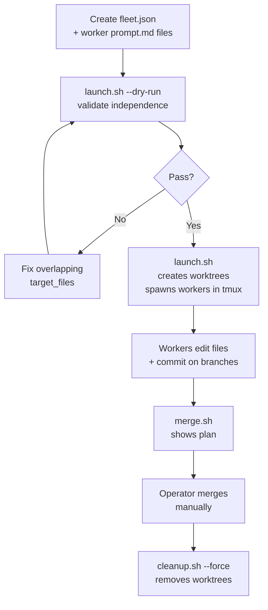

# worktree-fleet — Quick Reference

## Lifecycle



## Scripts

| Script | Args | Description |
|--------|------|-------------|
| `launch.sh` | `<fleet-root> [--dry-run]` | Validate independence, create worktrees, spawn workers in tmux |
| `status.sh` | `<fleet-name-or-root> [--json]` | Per-worktree progress, cost, completion state |
| `merge.sh` | `<fleet-name-or-root>` | Print merge plan (files changed, line counts) — no auto-merge |
| `cleanup.sh` | `<fleet-name-or-root> --force` | Remove git worktrees and branch locks |

```bash
# Typical run
bash ${AGENTS_SKILLS_DIR}/scripts/launch.sh $FLEET_ROOT --dry-run
bash ${AGENTS_SKILLS_DIR}/scripts/launch.sh $FLEET_ROOT
bash ${AGENTS_SKILLS_DIR}/scripts/status.sh $FLEET_ROOT
bash ${AGENTS_SKILLS_DIR}/scripts/merge.sh $FLEET_ROOT
bash ${AGENTS_SKILLS_DIR}/scripts/cleanup.sh $FLEET_ROOT --force
```

## Worker Type Override

Worktree workers always need `git commit` (Bash). If you set `type` to `read-only`, `write`, or `reviewer`, launch.sh **auto-overrides to `code-run`** with a warning. You don't need to set the type explicitly — `code-run` is the correct type for all worktree workers.

## Minimal fleet.json

```json
{
  "fleet_name": "my-fleet",
  "type": "worktree",
  "workers": [
    {
      "id": "worker-a",
      "task": "Refactor src/utils/foo.ts",
      "target_files": ["src/utils/foo.ts"],
      "branch": "refactor-foo"
    },
    {
      "id": "worker-b",
      "task": "Update docs/api.md",
      "target_files": ["docs/api.md"],
      "branch": "update-api-docs"
    }
  ]
}
```

Required per worker: `id`, `task`, `target_files`, `branch`. Everything else is optional.

## Common Gotchas

1. **Overlapping `target_files`** — Two workers declaring the same file (even via globs) causes launch to reject with exit 2. The validator checks glob overlap bidirectionally — fix your task split before retrying.

2. **Forgetting to commit** — Workers that don't commit leave unstaged changes. `merge.sh` has nothing to show and `git merge` has nothing to apply. Always include in every prompt: *"When you are done, commit your changes on the current branch with a descriptive message."*

3. **Skipping `--dry-run`** — Independence validation catches glob overlaps you didn't see (e.g. `src/**/*.ts` vs `src/utils/foo.ts`). Dry-run is fast — always run it first for new fleet configs.

4. **Skipping cleanup** — Worktrees hold branch locks. Stale worktrees block future branch creation with the same name. Always run `cleanup.sh --force` when done, even if you discarded a worker's branch.
